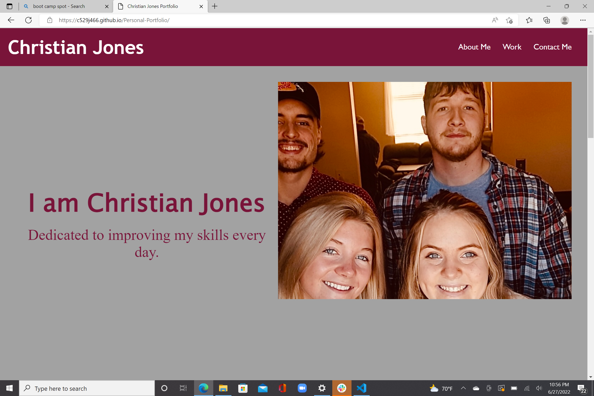

# <Personal Portfolio>

## Description


For this project, I was tasked with creating a personal portfolio with html and css, highlighting some of my previous work. My motivation to complete this project is to have a professional portfolio that potential employers can look at to see the work I've done. This portfolio packages work examples, personal information, and contact information for an employer to reference when considering me for a position.


## Installation

To install the portfolio, I first created the html and css documents, including images and links to my previous work. I then created a github repository, cloned that repository to my local device, copied the portfolio files to the repository, pushed the files to the repository on github, and then enabled pages on github to create a live link. 

## Usage

Provide instructions and examples for use. Include screenshots as needed.

To add a screenshot, create an `assets/images` folder in your repository and upload your screenshot to it. Then, using the relative filepath, add it to your README using the following syntax:

    ```md
    
    ```

## Credits

I recieved help on this project from my instructors, Henery Winget and Chris Sinlasath.

